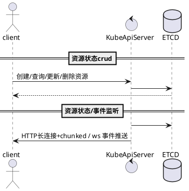
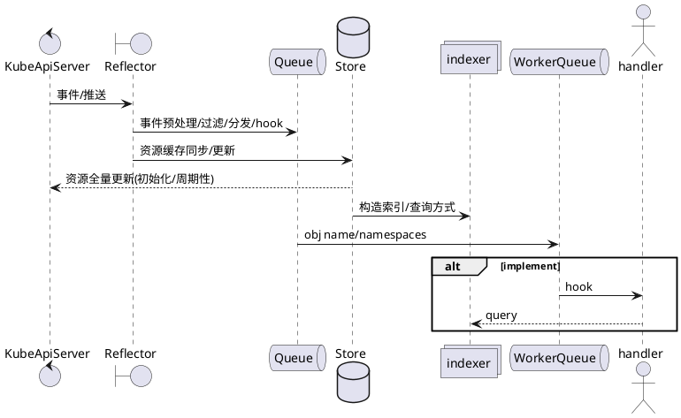
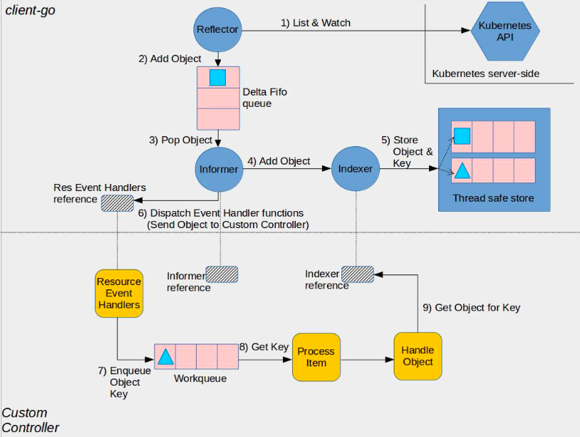
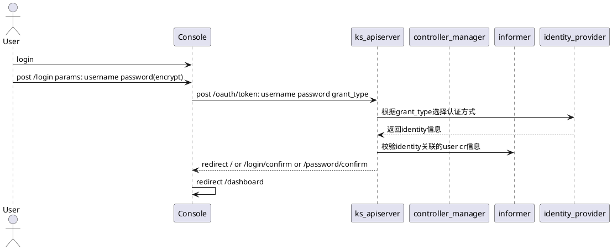

kubesphere基于client-go的原理介绍<!--more-->
#### 1. development

##### 1.1 requirement

- **goland** / **vscode**
- **kt connect** / **telepresence**

##### 1.2 install

1. download

   ```shell
   $ git clone https://github.com/kubesphere/kubesphere.git
   $ cd kubesphere 
   ```

2. update config dir

   ```text
   # kubesphere/pkg/apiserver/config/config.go
   # replace defaultConfigurationPath = "/etc/kubesphere" => ${customer_dir}
   ```

   ```text
   # kubesphere/pkg/models/routers/routers.go
   # replace ingressControllerFolder = "/etc/kubesphere/ingress-controller" => ${customer_ingress_dir}
   ```

3. download yaml

   ```shell
   # 通过ks管理页面/kubectl获取ks-apiserver的配置文件的config-map
   kubesphere-config
   # kubectl.exe get cm/kubesphere-config -n kubesphere-system --kubeconfig=.kube\config-73-205 -o yaml
   # kubesphere.yaml 放在步骤2中的 ${customer_dir} 目录下

   ks-router-config
   # kubectl.exe get cm/ks-router-config -n kubesphere-system --kubeconfig=.kube\config-73-205 -o yaml
   # ingress-controller-svc.yaml && ingress-controller.yaml 放在步骤2中的 ${customer_ingress_dir8} 目录下
   ```

4. run && server exchange

   ```shell
   $ go run kubesphere.io/kubesphere/cmd/ks-apiserver --kubeconfig=C:/Users/wupeng/.kube/config-73-205 
   $ ktctl.exe exchange ks-apiserver --expose 9090:9090 -n kubesphere-system -c .\.kube\config-73-205

   # 修改token过期时间
   # 修改kubesphere.yaml: authentication.oauthOptions.accessTokenMaxAge = 0
   ```

   ```shell
   $ ktctl.exe recover ks-apiserver -n kubesphere-system -c .\.kube\config-73-205
   $ ktctl.exe clean -c .\.kube\config-73-205
   ```

5. local debug
   [cookie识别异常](https://kubesphere.com.cn/forum/d/7891-kubesphere/17)
   ```text
   # 权限异常：设置 header: Authorization: Bearer ${token}
   # token为header: cookie中的token信息
   ```

#### 2  crd

##### 2.1 概念

**本质上k8s内置资源也是一种crd**，由k8s官方实现了内置资源的生命周期管理

| pod   | crd             |
|-------|-----------------|
| nginx | nginx-config-cr |
| kong  | kong-config-cr  |

##### 2.2 生命周期交互流程



###### 2.2.1 模式1

一种资源 对应 一个模型
一个实例化资源对象 对应 一条实体对象记录

比如: 建立一个水果类型的crd资源，接着实例化一个苹果、香蕉、梨子等等

1. 用来做少量数据的存储、类似config-map/secret的作用
2. 轻量级的api调用

###### 2.2.2 模式2

状态存储 + 事件推送

1. 异步/耗时事件处理
   比如：订单状态变更处理/网关配置更新

##### 2.3 crd的k8s状态管理组件 controller / Informer

[https://github.com/kubernetes/client-go/tree/master/tools/cache][源码实现]

1. Reflector 状态监听
2. Queue 事件队列
3. Store 资源缓存
4. indexer/lister 资源索引/查询
5. WorkerQueue/Worker 任务队列/工作单元



##### 2.4 A&Q

###### 2.4.1 Reflector实现原理

```go
type controller struct {
	config         Config
	reflector      *Reflector
	reflectorMutex sync.RWMutex
	clock          clock.Clock
}

type Controller interface {
	// Run does two things.  One is to construct and run a Reflector
	// to pump objects/notifications from the Config's ListerWatcher
	// to the Config's Queue and possibly invoke the occasional Resync
	// on that Queue.  The other is to repeatedly Pop from the Queue
	// and process with the Config's ProcessFunc.  Both of these
	// continue until `stopCh` is closed.
	Run(stopCh <-chan struct{})

	// HasSynced delegates to the Config's Queue
	HasSynced() bool

	// LastSyncResourceVersion delegates to the Reflector when there
	// is one, otherwise returns the empty string
	LastSyncResourceVersion() string
}

func (c *controller) Run(stopCh <-chan struct{}) {
	defer utilruntime.HandleCrash()
	go func() {
		<-stopCh
		c.config.Queue.Close()
	}()
	r := NewReflector(
		c.config.ListerWatcher,
		c.config.ObjectType,
		c.config.Queue,
		c.config.FullResyncPeriod,
	)
	r.ShouldResync = c.config.ShouldResync
	r.WatchListPageSize = c.config.WatchListPageSize
	r.clock = c.clock
	if c.config.WatchErrorHandler != nil {
		r.watchErrorHandler = c.config.WatchErrorHandler
	}

	c.reflectorMutex.Lock()
	c.reflector = r
	c.reflectorMutex.Unlock()

	var wg wait.Group

	wg.StartWithChannel(stopCh, r.Run) 

	wait.Until(c.processLoop, time.Second, stopCh) 
	wg.Wait()
}
```

```go
// resource ListAndWatch
func (r *Reflector) Run(stopCh <-chan struct{}) {
	klog.V(3).Infof("Starting reflector %s (%s) from %s", r.expectedTypeName, r.resyncPeriod, r.name)
	wait.BackoffUntil(func() {
		if err := r.ListAndWatch(stopCh); err != nil {
			r.watchErrorHandler(r, err)
		}
	}, r.backoffManager, true, stopCh)
	klog.V(3).Infof("Stopping reflector %s (%s) from %s", r.expectedTypeName, r.resyncPeriod, r.name)
}
```

```go
// obj handler loop
func (c *controller) processLoop() {
	for {
		obj, err := c.config.Queue.Pop(PopProcessFunc(c.config.Process))
		if err != nil {
			if err == ErrFIFOClosed {
				return
			}
			if c.config.RetryOnError {
				// This is the safe way to re-enqueue.
				c.config.Queue.AddIfNotPresent(obj)
			}
		}
	}
}
```

```go
func (r *Reflector) ListAndWatch(stopCh <-chan struct{}) error {
	klog.V(3).Infof("Listing and watching %v from %s", r.expectedTypeName, r.name)
	var resourceVersion string

	options := metav1.ListOptions{ResourceVersion: r.relistResourceVersion()}

	if err := func() error {
		go func() {
			defer func() {
				if r := recover(); r != nil {
					panicCh <- r
				}
			}()
			
			pager := pager.New(pager.SimplePageFunc(func(opts metav1.ListOptions) (runtime.Object, error) {
				return r.listerWatcher.List(opts)
			}))
			list, paginatedResult, err = pager.List(context.Background(), options)
			close(listCh)
		}()
		select {
		case <-stopCh:
			return nil
		case r := <-panicCh:
			panic(r)
		case <-listCh:
		}

	
		listMetaInterface, err := meta.ListAccessor(list)
		if err != nil {
			return fmt.Errorf("unable to understand list result %#v: %v", list, err)
		}
		resourceVersion = listMetaInterface.GetResourceVersion()
		
		items, err := meta.ExtractList(list)
		if err != nil {
			return fmt.Errorf("unable to understand list result %#v (%v)", list, err)
		}
		
		if err := r.syncWith(items, resourceVersion); err != nil {
			return fmt.Errorf("unable to sync list result: %v", err)
		}
	
		return nil
	}(); err != nil {
		return err
	}

	resyncerrc := make(chan error, 1)
	cancelCh := make(chan struct{})
	defer close(cancelCh)
	go func() {
		resyncCh, cleanup := r.resyncChan()
		defer func() {
			cleanup() // Call the last one written into cleanup
		}()
		for {
			select {
			case <-resyncCh:
			case <-stopCh:
				return
			case <-cancelCh:
				return
			}
			if r.ShouldResync == nil || r.ShouldResync() {
				klog.V(4).Infof("%s: forcing resync", r.name)
				if err := r.store.Resync(); err != nil {
					resyncerrc <- err
					return
				}
			}
			cleanup()
			resyncCh, cleanup = r.resyncChan()
		}
	}()

	for {
		// give the stopCh a chance to stop the loop, even in case of continue statements further down on errors
		select {
		case <-stopCh:
			return nil
		default:
		}

		timeoutSeconds := int64(minWatchTimeout.Seconds() * (rand.Float64() + 1.0))
		options = metav1.ListOptions{
			ResourceVersion: resourceVersion,
			TimeoutSeconds: &timeoutSeconds,
			AllowWatchBookmarks: true,
		}

		// start the clock before sending the request, since some proxies won't flush headers until after the first watch event is sent
		start := r.clock.Now()
		w, err := r.listerWatcher.Watch(options)
		if err != nil {
			return err
		}

		if err := r.watchHandler(start, w, &resourceVersion, resyncerrc, stopCh); err != nil {
		
		}
	}
}
```

```go
func NewFilteredListWatchFromClient(c Getter, resource string, namespace string, optionsModifier func(options *metav1.ListOptions)) *ListWatch {
	listFunc := func(options metav1.ListOptions) (runtime.Object, error) {
		optionsModifier(&options)
		return c.Get().
			Namespace(namespace).
			Resource(resource).
			VersionedParams(&options, metav1.ParameterCodec).
			Do(context.TODO()).
			Get()
	}
	watchFunc := func(options metav1.ListOptions) (watch.Interface, error) {
		options.Watch = true
		optionsModifier(&options)
		return c.Get().
			Namespace(namespace).
			Resource(resource).
			VersionedParams(&options, metav1.ParameterCodec).
			Watch(context.TODO())
	}
	return &ListWatch{ListFunc: listFunc, WatchFunc: watchFunc}
```

````go
func (r *Reflector) watchHandler(start time.Time, w watch.Interface, resourceVersion *string, errc chan error, stopCh <-chan struct{}) error {
	eventCount := 0
	defer w.Stop()

loop:
	for {
		select {
		case <-stopCh:
			return errorStopRequested
		case err := <-errc:
			return err
		case event, ok := <-w.ResultChan():
			if !ok {
				break loop
			}
			if event.Type == watch.Error {
				return apierrors.FromObject(event.Object)
			}
			if r.expectedType != nil {
				if e, a := r.expectedType, reflect.TypeOf(event.Object); e != a {
					utilruntime.HandleError(fmt.Errorf("%s: expected type %v, but watch event object had type %v", r.name, e, a))
					continue
				}
			}
			if r.expectedGVK != nil {
				if e, a := *r.expectedGVK, event.Object.GetObjectKind().GroupVersionKind(); e != a {
					utilruntime.HandleError(fmt.Errorf("%s: expected gvk %v, but watch event object had gvk %v", r.name, e, a))
					continue
				}
			}
			meta, err := meta.Accessor(event.Object)
			if err != nil {
				utilruntime.HandleError(fmt.Errorf("%s: unable to understand watch event %#v", r.name, event))
				continue
			}
			newResourceVersion := meta.GetResourceVersion()
			switch event.Type {
			case watch.Added:
				err := r.store.Add(event.Object)
				if err != nil {
					utilruntime.HandleError(fmt.Errorf("%s: unable to add watch event object (%#v) to store: %v", r.name, event.Object, err))
				}
			case watch.Modified:
				err := r.store.Update(event.Object)
				if err != nil {
					utilruntime.HandleError(fmt.Errorf("%s: unable to update watch event object (%#v) to store: %v", r.name, event.Object, err))
				}
			case watch.Deleted:
				err := r.store.Delete(event.Object)
				if err != nil {
					utilruntime.HandleError(fmt.Errorf("%s: unable to delete watch event object (%#v) from store: %v", r.name, event.Object, err))
				}
			case watch.Bookmark:
				// A `Bookmark` means watch has synced here, just update the resourceVersion
			default:
				utilruntime.HandleError(fmt.Errorf("%s: unable to understand watch event %#v", r.name, event))
			}
			*resourceVersion = newResourceVersion
			r.setLastSyncResourceVersion(newResourceVersion)
			if rvu, ok := r.store.(ResourceVersionUpdater); ok {
				rvu.UpdateResourceVersion(newResourceVersion)
			}
			eventCount++
		}
	}

	return nil
}
````

```go
// Reflector watches a specified resource and causes all changes to be reflected in the given store.
type Reflector struct {
	// name identifies this reflector. By default it will be a file:line if possible.
	name string
	expectedTypeName string
	expectedType reflect.Type
	// The GVK of the object we expect to place in the store if unstructured.
	expectedGVK *schema.GroupVersionKind
	// The destination to sync up with the watch source
	store Store
	// listerWatcher is used to perform lists and watches.
	listerWatcher ListerWatcher

	// backoff manages backoff of ListWatch
	backoffManager wait.BackoffManager
	// initConnBackoffManager manages backoff the initial connection with the Watch calll of ListAndWatch.
	initConnBackoffManager wait.BackoffManager

	resyncPeriod time.Duration
	// ShouldResync is invoked periodically and whenever it returns `true` the Store's Resync operation is invoked
	ShouldResync func() bool
	// clock allows tests to manipulate time
	clock clock.Clock
	// paginatedResult defines whether pagination should be forced for list calls.
	// It is set based on the result of the initial list call.
	paginatedResult bool
	lastSyncResourceVersion string
	isLastSyncResourceVersionUnavailable bool
	// lastSyncResourceVersionMutex guards read/write access to lastSyncResourceVersion
	lastSyncResourceVersionMutex sync.RWMutex
	WatchListPageSize int64
	// Called whenever the ListAndWatch drops the connection with an error.
	watchErrorHandler WatchErrorHandler
}

```

###### 2.4.2 Store同步机制

```go
// 周期性同步
go func() {
		resyncCh, cleanup := r.resyncChan()
		defer func() {
			cleanup() // Call the last one written into cleanup
		}()
		for {
			select {
			case <-resyncCh:
			case <-stopCh:
				return
			case <-cancelCh:
				return
			}
			if r.ShouldResync == nil || r.ShouldResync() {
				klog.V(4).Infof("%s: forcing resync", r.name)
				if err := r.store.Resync(); err != nil {
					resyncerrc <- err
					return
				}
			}
			cleanup()
			resyncCh, cleanup = r.resyncChan()
		}
	}()
```

```go
// 事件触发时同步
func (r *Reflector) watchHandler(start time.Time, w watch.Interface, resourceVersion *string, errc chan error, stopCh <-chan struct{}) error {
	eventCount := 0
	defer w.Stop()

loop:
	for {
		select {
		case <-stopCh:
			return errorStopRequested
		case err := <-errc:
			return err
		case event, ok := <-w.ResultChan():
			meta, err := meta.Accessor(event.Object)
			if err != nil {
				utilruntime.HandleError(fmt.Errorf("%s: unable to understand watch event %#v", r.name, event))
				continue
			}
			newResourceVersion := meta.GetResourceVersion()
			switch event.Type {
			case watch.Added:
				err := r.store.Add(event.Object)
				if err != nil {
					utilruntime.HandleError(fmt.Errorf("%s: unable to add watch event object (%#v) to store: %v", r.name, event.Object, err))
				}
			case watch.Modified:
				err := r.store.Update(event.Object)
				if err != nil {
					utilruntime.HandleError(fmt.Errorf("%s: unable to update watch event object (%#v) to store: %v", r.name, event.Object, err))
				}
			case watch.Deleted:
				err := r.store.Delete(event.Object)
				if err != nil {
					utilruntime.HandleError(fmt.Errorf("%s: unable to delete watch event object (%#v) from store: %v", r.name, event.Object, err))
				}
			case watch.Bookmark:
				// A `Bookmark` means watch has synced here, just update the resourceVersion
			default:
				utilruntime.HandleError(fmt.Errorf("%s: unable to understand watch event %#v", r.name, event))
			}
			*resourceVersion = newResourceVersion
			r.setLastSyncResourceVersion(newResourceVersion)
			if rvu, ok := r.store.(ResourceVersionUpdater); ok {
				rvu.UpdateResourceVersion(newResourceVersion)
			}
			eventCount++
		}
	}

	return nil
}
```

###### 2.4.3 完全使用k8s cache机制带来的影响

1. 缓存的资源功能性设计/数据量上限制
2. 对于资源数据的查询只支持简单的过滤查询以及query的过滤需要

###### 2.4.4 缓存同步，如果有很多个informer全量同步，对性能损耗很大

1. 全量缓存
2. 增量缓存
3. bookmark机制

###### 2.4.5 多个事件并发event, 对于event的处理
1. DeltaFIEOQueue事件合并
##### 2.5 client-go
###### 2.5.1 架构图

###### 2.5.2 guide
1. quick start

   ```shell
   $ go get k8s.io/client-go@latest
   ```

2. example

   ```go
   package main

   import (
   	"context"
   	"fmt"
   	v1 "k8s.io/api/apps/v1"
   	core_v1 "k8s.io/api/core/v1"
   	metav1 "k8s.io/apimachinery/pkg/apis/meta/v1"
   	"k8s.io/apimachinery/pkg/runtime/schema"
   	_ "k8s.io/client-go"
   	"k8s.io/client-go/kubernetes"
   	"k8s.io/client-go/kubernetes/scheme"
   	"k8s.io/client-go/rest"
   	"k8s.io/client-go/tools/clientcmd"
   	"k8s.io/client-go/util/homedir"
   	"path/filepath"
   )

   func main() {
   	//lib.ClientGoDemo01()
   	config, err := clientcmd.BuildConfigFromFlags("", filepath.Join(homedir.HomeDir(), ".kube/config-73-205"))
   	if err != nil {
   		panic(err)
   	}
   	config.GroupVersion = &schema.GroupVersion{Group: "apps", Version: "v1"}
   	config.NegotiatedSerializer = scheme.Codecs
   	config.APIPath = "/apis"
   	restclient, err := rest.RESTClientFor(config)
   	if err != nil {
   		panic(err)
   	}

   	deploy := v1.Deployment{}
   	if err = restclient.Get().Namespace("kubesphere-system").
   		Resource("deployments").
   		Name("ks-apiserver").
   		Do(context.Background()).Into(&deploy); err != nil {
   		panic(err)
   	}
   	fmt.Println(deploy)

   	clientset, err := kubernetes.NewForConfig(config)
   	if err != nil {
   		panic(err)
   	}
   	pod := &core_v1.Pod{}
   	if pod, err = clientset.CoreV1().Pods("kubesphere-system").Get(context.Background(),
   		"ks-apiserver-7c8c448bbb-xk7bx", metav1.GetOptions{}); err != nil {
   		panic(err)
   	}
   	fmt.Println(*pod)
   }
   ```

#### 3 kubesphere

##### 3.1 项目结构

- ks-console: 管理界面
- ks-apiserver: API内部通信接口
- ks-controller-manager: 所有CRD业务的Controller管理中心
[ks](https://www.onemodel.app/d/e8fUjiUmI0oOK2s1ITJEu)
##### 3.2 登录流程



#### 4 question


