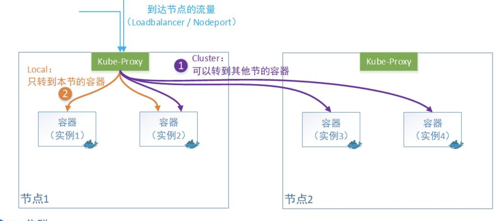

云原生场景下，通过x-forwarded-for需要记录请求客户端真实IP,通过external-traffic-policy设置kube-proxy对流量的转发策略<!--more-->

##### 1 k8s Serivce中 external-traffic-policy 的作用
```yaml
apiVersion: v1
kind: Service
metadata:
  name: my-service
spec:
  selector:
    app.kubernetes.io/name: MyApp
  ports:
    - protocol: TCP
      port: 80
      targetPort: 9376
  externalTrafficPolicy: Local
#  internalTrafficPolicy: Cluster
```

1. 当externalTrafficPolicy为Cluster，默认值
```text
特点：kube-proxy转发流量时会做一次SNAT，替换掉报文的源IP，即请求的源地址IP
     被替换成上一个转发节点的IP
优势：负载均衡效果好一些，流量可以转发到多个节点的pod上
```
2. 当externalTrafficPolicy为Local
```text
特点：只转发给本机的容器，绝不跨节点转发。Kube-proxy转发时会保留客户端源IP。
劣势：请求只能转发到当前节点上的Pod上，导致流量不均衡，因此需要在此之上再加一
     层Loadbalancer来均衡流量
```


##### 2 ingress-nginx 配置说明
###### 2.1 use-forwarded-headers: "true"
```text
作用：允许nginx向后端服务器传递X-Forwarded-*头信息
```
###### 2.2 compute-full-forwarded-for: "true"
```text
说明：在只设置 use-forwarded-headers: "true" 的情况下X-Forwarded-For
     每次是从remote_addr获取的值，每次只取上一层代理的IP。
作用：将客户端用户访问所经过的代理ip按逗号连接的列表形式记录下来。
```

参考链接：[ingress-nginx-doc](https://kubernetes.github.io/ingress-nginx/user-guide/nginx-configuration/configmap/#use-forwarded-headers)

##### 3 注意事项
###### 3.1 在k8s集群中，通过单个节点IP 访问 ingress-nginx-svc，再访问后端服务时
```text
需要在ingress-nginx-controller的deployment中设置节点亲和性，保证nginx的
Pod的调度到请求IP对应的节点上
例如：通过 ${master01-IP}:${node-port} 访问 ingress-nginx，需要设置
deployment的节点选择器或者通过亲和性控制更小的粒度
```
```yaml
# 设置节点选择器
nodeSelector:
  kubernetes.io/hostname: master01

# 如果k8s集群节点有污点，还需要设置污点容忍度
tolerations:
  - key: node-role.kubernetes.io/master
    operator: Exists
    effect: NoSchedule
```

**参考链接🔗**：[service-traffic-policy](https://kubernetes.io/zh-cn/docs/concepts/services-networking/service-traffic-policy/)

**参考链接🔗**：[how-to-get-real-ip-in-pod](https://kubesphere.io/zh/blogs/how-to-get-real-ip-in-pod/#%E9%80%9A%E8%BF%87-lb---ingress---service-%E8%AE%BF%E9%97%AE%E8%8E%B7%E5%8F%96%E7%9C%9F%E5%AE%9E-ip)

**参考链接🔗**：[external-traffic-policy](https://andyoung.blog.csdn.net/article/details/122215040)