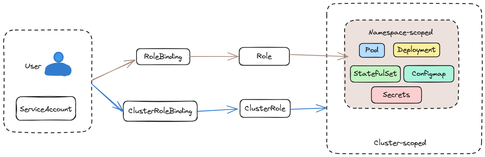
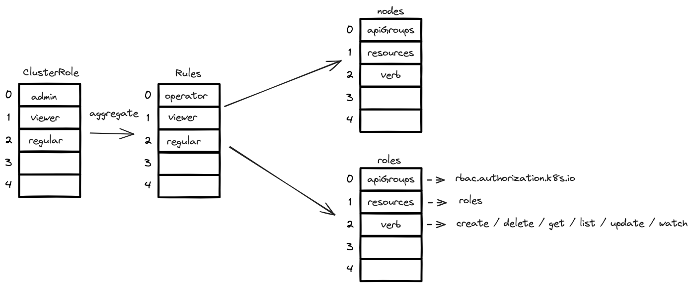

KubeSphere 的权限设计围绕Workspace、Project和 RBAC 的中心概念，允许管理员定义访问控制、管理用户以及控制资源可见性和管理。 它通过引入自己的抽象来扩展
Kubernetes 的 RBAC 功能，以支持 Kubernetes 集群内的多租户和资源的高效治理。 细粒度控制、资源隔离以及与各种身份验证方法的集成是 KubeSphere 安全和访问管理框架的关键方面。<!--more-->
#### 1 Kubernetes 权限设计
**在 Kubernetes 中，权限设计是非常重要的，因为它控制着对集群资源的访问和操作。Kubernetes 使用 RBAC（基于角色的访问控制）来管理对其 API 资源的访问**
1. RBAC (基于角色的访问控制)：Kubernetes 使用 RBAC 管理对 API 资源的访问权限。在集群中，可以定义角色（Roles）和角色绑定（RoleBindings），控制着不同用户和服务账号对于资源的操作权限
2. 网络策略（Network Policies）：用于定义和实施 Pod 之间的通信规则。这允许管理员控制哪些 Pod 可以彼此通信以及通信的方式。
3. 认证（Authentication）：Kubernetes 支持多种身份验证方式，包括证书、令牌、基本身份验证等，用于验证用户或服务账号的身份。
4. 审计日志记录（Audit Logging）：记录对集群资源的访问和操作，提供审计追踪，有助于监控安全事件。这里记录了对集群资源的访问和操作日志。

##### 1.1 认证 authentication
**在 Kubernetes 中，认证（Authentication） 是用于验证用户或服务账户身份的过程。Kubernetes 支持多种身份验证机制，包括：**
1. 令牌（Tokens）：基于令牌的认证，使用令牌进行用户身份验证。用户提供有效的令牌作为其身份的证明。
2. 证书（Certificates）：基于证书的认证，使用 TLS 证书进行用户身份验证。用户需要提供有效的证书。
3. OpenID Connect：Kubernetes也支持使用 OpenID Connect 进行身份验证，这是建立在 OAuth 2.0 协议之上的一种身份验证和授权协议。

##### 1.2 授权 authorization
**其中RBAC（基于角色的访问控制） 是 Kubernetes 中用于管理对 API 资源访问的权限控制机制。它基于四个主要元素：角色、角色绑定、服务账户和命名空间。**
1. 角色（Roles）：角色是一组权限规则，定义了对特定资源的操作权限，例如创建、读取、更新或删除。它们被定义在特定命名空间中。
2. 角色绑定（RoleBindings）：角色绑定将角色分配给用户、组或服务账户。它建立了角色和实际用户/服务账户之间的关联，授予特定实体在特定命名空间中执行特定操作的权限。
3. 服务账户（Service Accounts）：服务账户是用于代表在集群中运行的进程的对象。它们能够分配角色，并作为 Pod 运行时使用，使应用程序能够与 Kubernetes API 交互。
4. 命名空间隔离：RBAC 角色和角色绑定可以在特定的命名空间中进行配置，以实现对命名空间内资源的权限控制。这使得集群资源可以根据命名空间进行隔离。

**RBAC 通过定义角色和角色绑定，实现了对集群资源的细粒度访问控制，确保只有经过授权的用户或服务账户可以执行特定的操作。这有助于保护集群免受未经授权的访问和操作。**

#### 2 KubeSphere 权限设计
**与Kubernetes权限模型的结合**

KubeSphere在Kubernetes权限模型的基础上提供了额外的功能和抽象，包括更多角色和访问控制层级，包括：平台权限/集群权限/企业空间权限/节点组权限。

**细粒度权限控制**

KubeSphere将集群资源、项目、团队和用户分别抽象为Kubernetes资源，以CRD的形式提供Restful风格的API，
包括对集群资源、项目、团队和个人级别的权限管理。

**自定义角色和策略**

KubeSphere允许创建和管理自定义角色以及灵活的策略定义。

**用户与组织管理**

KubeSphere提供的用户和组织管理功能，包括身份集成、LDAP、RBAC 的管理，以及如何实现统一的身份和访问控制。
