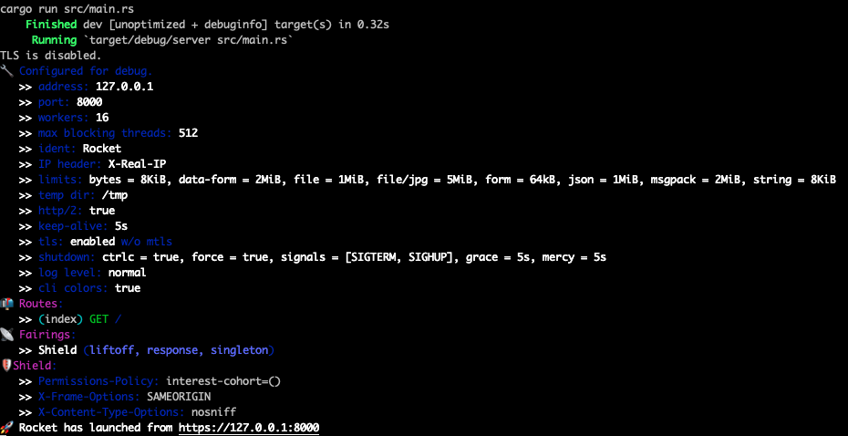
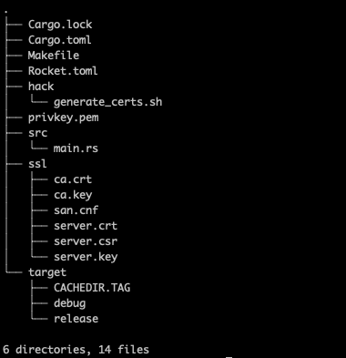

在服务内部启用HTTPS协议时，本文主要介绍在使用selfsigned自签名证书来保证内部服务安全通信的过程中，如何将自签名证书加入系统信任链，来解决CA证书不被Linux或者容器系统信任的问题<!--more-->
#### 1 如何添加CA证书
##### 1.1 添加到 /usr/local/share/ca-certificates/ 目录下
```shell
cp ca.crt /usr/local/share/ca-certificates/ \
&& update-ca-certificates
```
##### 1.2 添加到 /usr/share/ca-certificates/ 目录下
```shell
# 添加证书并配置证书的引用路径
cp ca.crt /usr/share/ca-certificates/smartcatio/ \
echo "smartcatio/ca.crt" >> /etc/ca-certificates.conf \
&& update-ca-certificates
```
#### 2 示例
##### 2.1 创建https-server
```shell
git clone https://github.com/smartcat999/selfsigned-tls-server.git \
&& cd selfsigned-tls-server \
&& make generate \
&& make run
```

##### 2.2 访问https服务
```shell
# 访问失败，ca证书不被系统信任
curl https://127.0.0.1:8000
```

##### 2.3 导入https的ca证书到系统中

```shell
cp ssl/ca.crt /usr/local/share/ca-certificates/ \
&& update-ca-certificates
```
##### 2.4 再次访问https服务
```shell
curl https://127.0.0.1:8000
```

