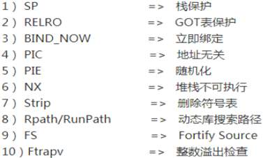

安全编译选项旨在帮助开发者在编译阶段提高软件的安全性，减少潜在的安全漏洞。这些选项在编译源代码时实施特定的安全措施，以防止常见的攻击，如缓冲区溢出、格式字符串攻击、堆栈溢出等<!--more-->
#### 1 安全编译选项介绍
典型安全编译选项如下：

##### 1.1 BIND_NOW 立即绑定

**编译选项：-Wl,-z,now**

标记ELF程序在启动时就解析所有动态符号（而不是“按需形式”(延时绑定)，也称为“立即绑定”），以便将GOT完全设为只读。-Wl是gcc的参数，表示编译器将后面的参数传递给链接器ld。

##### 1.2 NX 堆栈不可执行

**编译选项：-Wl,-z noexecstack**

NX选项作用是让堆栈上的数据不可被当做指令执行。因为利用缓冲区溢出的shellcode一般都是放在堆栈上，如果将堆栈设置不可执行，即使溢出成功跳转到shellcode，程序在尝试执行指令时CPU就会抛出异常，而不是去执行恶意指令，提升了攻击者的难度。

##### 1.3 PIC  地址无关

**编译选项：-fPIC**

fpic的目的是为了做到动态加载so文件，每次运行都通过全局偏移表(GOT)索引获取到so中的函数真实地址（其实就是间接寻址），所以每次so中的函数地址都不是固定的

##### 1.4 PIE  随机化

**编译选项：-pie,-fpie(-fPIE)**

fpie与fpic类似，它使本程序内的代码变得位置无关，让本程序内的函数地址变得随机。有了PIE的地址随机化后，无法利用本程序内的函数。

##### 1.5 RELRO   GOT表保护

**编译选项：-Wl,-z,relro,-z,now**

RELRO（RELocation Read-Only） 选项顾名思义，正是用来防止恶意代码修改 GOT 表的。增加该选项后，程序在装载(Load) 而不是运行的时候就解析所有的动态库函数地址，并将这些地址填充到相应的 GOT 表中，然后当装载程序移交控制权时，将 GOT 表设置为只读，这样就保证了运行时 GOT 表不允许覆写。

##### 1.6 SP  栈保护

**编译选项：-fstack-protector-all/-fstack-protector-strong**

启用栈保护后，函数执行前先往栈里插入校验信息（canary），在函数返回时进行验证。如果不正确就中止程序。因为校验信息的位置是随机的，攻击者很难猜到和避开，所以开启以后攻击难度非常高。

